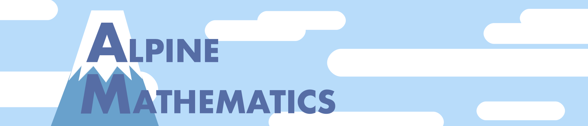

# Documentation Modules

In some cases, documentation on the Proofscape language, and on the PISE
(Proofscape Integrated Study Environment) software, is best written in
Proofscape modules, and viewed within PISE itself. This repo is a place to
write such "doc modules".

## How to contribute?

Contributing is easy. Basically, just fork this repository, add or improve some
modules, and make a pull request. However, please be sure to read the
[CONTRIBUTING.md](CONTRIBUTING.md) first, and follow the guidelines stated
there.

The easiest way to develop Proofscape modules is by
[downloading and running PISE](https://alpinemath.org/download/pise.html),
the Proofscape Integrated Study Environment, on your own computer.

For an intro to PISE, you might want to try out
[this tutorial](https://pise.alpinemath.org/docs/Tutorial).

## What's the license?

Everything in the library is licensed under the 
Mozilla Public License version 2.0
[(MPL-2.0)](https://www.mozilla.org/en-US/MPL/2.0/).
